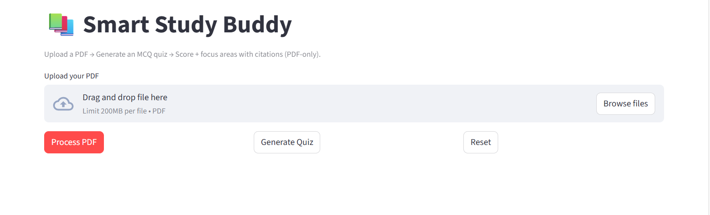

# Smart Study Buddy 📚🤖

An AI-powered study assistant that converts PDFs into high-quality MCQ quizzes with scoring, topic-level feedback, and source citations.

## 📸 Demo

### Upload PDF


### Take the quiz


### View results


## 🚀 What this app does
- Upload a PDF (lecture notes, slides, textbooks)
- Automatically extracts and chunks content
- Generates MCQ quizzes using OpenAI
- Scores answers and highlights weak focus areas
- Provides page-level citations (PDF-only)

## 🧠 Why I built this
Studying from long PDFs is time-consuming and inefficient.  
This tool helps learners **test understanding quickly** and **focus on weak areas** without re-reading everything.

## 🔍 How it works
1. User uploads a PDF document
2. Text is extracted and split into manageable chunks
3. OpenAI generates MCQs with correct answers and explanations
4. User answers questions in the Streamlit UI
5. App computes the score and identifies weak topics
6. Each question includes page-level citations back to the PDF

## 🛠️ Tech Stack
- **Frontend**: Streamlit
- **LLM / AI**: OpenAI API
- **Document Processing**: PDF text extraction + chunking
- **Language**: Python

## ⚙️ How to run locally

### 1) Clone the repo
```bash
git clone https://github.com/RamyaVetukuri/llm-apps.git
cd llm-apps/smart-study-buddy
